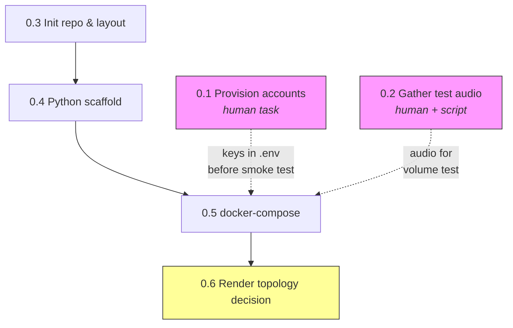

# Milestone 0 — Environment & Project Foundation

> **Goal:** Remove every source of setup friction before real work begins. After M0, every build session is spent building, not configuring.

**LLM provider decision:** Google Gemini 2.5 Flash via the `google-genai` Python SDK. Free tier (500 RPD, 10M TPD) covers dev and bulk testing. Native `response_schema` guarantees JSON schema compliance — strongest structured-output story of any free provider. Strong bilingual en/es, fast inference.

---

## Task 0.1 — Provision external accounts & API keys

- **What:** Sign up for Deepgram, Anthropic, Cloudflare R2, and Render. Collect API keys / credentials into a local `.env`.
- **Files:** `.env` (gitignored), `.env.example` (committed, with placeholder values)
- **Depends on:** nothing
- **Key decisions:**
  1. Deepgram plan tier — free tier gives 45 hrs/month; sufficient for dev but cuts it close if testing 1000 files with real audio. Confirm limits.
  2. R2 bucket naming and region — single bucket or separate dev/prod? Region closest to Render deployment region.
  3. Google Gemini free-tier limits — 500 RPD, 10 RPM. The 1000-file test would need to span two days or use a paid key for that one run. Confirm whether the free tier is sufficient for the demo or if a brief paid burst is needed.

---

## Task 0.2 — Gather test audio recordings

- **What:** Source 3–4 public sales-call recordings (varied lengths, at least one 20–30 min, at least one bilingual en/es) and write a script to generate 1,000 tiny valid WAV stubs for bulk-upload testing.
- **Files:** `tests/fixtures/README.md` (sourcing notes + licenses), `tests/fixtures/generate_stubs.py` (WAV generator script), audio files gitignored
- **Depends on:** nothing
- **Key decisions:**
  1. **Public sources:** LibriSpeech (multi-speaker, English, free), CallHome Spanish corpus (bilingual), or YouTube-sourced sales role-plays (check CC license). Need diarization-friendly recordings (2+ speakers, not heavily overlapping).
  2. **Stub generation for 1000-file test:** Generate 1-second silent WAV files with valid headers (trivial with Python `wave` module). These test the upload pipeline and queue, not transcription quality — real audio tests cover that separately.
  3. **Storage:** gitignored `tests/fixtures/audio/` directory, downloaded via a `make fetch-fixtures` target or documented curl commands. Stubs generated on the fly.

---

## Task 0.3 — Initialize repository & folder structure

- **What:** `git init`, establish the directory layout, `.gitignore`, README stub, first commit.
- **Files:** repo root — all directories created (empty `.gitkeep` where needed)
- **Depends on:** nothing
- **Key decisions:**
  1. **Layout:** mono-repo with `backend/` and `frontend/` at root, or flat with `app/` for Python and `web/` for React? Recommend `backend/` + `frontend/` — clear boundary, separate Dockerfiles, matches Render's two-service deploy.
  2. **Backend package structure:** `backend/app/` with sub-packages `api/`, `worker/`, `services/`, `models/`, `core/` (config, storage interface). Flat enough to navigate, structured enough that imports are obvious.
  3. **What goes in the first commit:** directory tree, `.gitignore`, `.env.example`, `README.md` stub, `Makefile` stub. No application code — that's task 0.4+.

**Proposed layout:**
```
call_analyzer/
  backend/
    app/
      api/          # FastAPI routes
      worker/       # arq task definitions
      services/     # transcription.py, analysis.py
      models/       # SQLAlchemy / Pydantic models
      core/         # config.py, storage.py
    tests/
      fixtures/     # test audio + generator
    Dockerfile
    pyproject.toml
    uv.lock
  frontend/
    # Vite React app (scaffolded in M4)
    Dockerfile
  docker-compose.yml
  Makefile
  README.md
  .env.example
  .gitignore
```

---

## Task 0.4 — Python project & dependency scaffold

- **What:** `pyproject.toml`, pinned requirements files, `app/core/config.py` (Pydantic Settings loading `.env`), bare `app/main.py` returning 200 on `/health`.
- **Files:** `backend/pyproject.toml`, `backend/uv.lock`, `backend/app/core/config.py`, `backend/app/main.py`
- **Depends on:** 0.3
- **Key decisions:**
  1. **Package manager:** `uv` for dependency management. `pyproject.toml` as the single source of truth, `uv.lock` for reproducible installs. Fast, deterministic, replaces pip/pip-tools entirely.
  2. **Core dependencies:** `fastapi`, `uvicorn[standard]`, `arq`, `sqlalchemy[asyncio]`, `asyncpg`, `alembic`, `httpx`, `boto3` (or `aioboto3` for async S3), `deepgram-sdk`, `google-genai`, `pydantic-settings`, `python-multipart`. Dev extras: `pytest`, `pytest-asyncio`, `httpx` (for test client), `ruff`.
  3. **Config shape:** single `Settings` class loading from `.env`, with fields for all service URLs/keys, explicit defaults for local dev (postgres on localhost:5432, redis on localhost:6379, minio on localhost:9000).

---

## Task 0.5 — docker-compose local environment

- **What:** `docker-compose.yml` with 5 services (api, worker, redis, postgres, minio), Dockerfile for backend, verify all containers start, connect, and the `/health` endpoint responds.
- **Files:** `docker-compose.yml`, `backend/Dockerfile`, health-check verification notes
- **Depends on:** 0.4
- **Key decisions:**
  1. **Service versions:** Postgres 16, Redis 7, MinIO latest. Pin image tags for reproducibility.
  2. **Hot reload in dev:** Mount `backend/` as a volume into the api/worker containers, run uvicorn with `--reload`. Avoids rebuilding on every code change.
  3. **MinIO setup:** Needs a startup script or healthcheck + `mc` command to create the default bucket on first run. Use a `minio-init` one-shot container or an entrypoint script.

---

## Task 0.6 — Resolve Render deployment topology

- **What:** Decide and document whether the arq worker runs as a separate Render Background Worker (paid) or as a second process inside the Web Service container (free-tier compatible). Record the decision and reasoning.
- **Files:** decision recorded in `README.md` or a short `docs/decisions/001-render-topology.md`
- **Depends on:** 0.5 (hands-on docker-compose experience informs feasibility)
- **Key decisions:**
  1. **Cost vs. reliability:** Render's free tier doesn't support Background Workers. Running worker as a second process (e.g., via `supervisord` or a shell script) keeps it free but means a deploy restarts both API and worker, and a worker crash may not be independently restarted.
  2. **Impact on scaling narrative:** The take-home's scaling section talks about horizontal workers. If the demo runs both in one container, does that undermine the story? (No — docker-compose already proves separation; Render is a deployment convenience.)
  3. **Recommendation:** Single container with both processes for the demo (free tier, simpler). Document that production separates them. This is honest and pragmatic.

---

## Dependency graph



**Solid arrows** = hard dependency (must finish first). **Dashed arrows** = soft dependency (nice to have, not blocking). **Pink** = human-paced tasks (start immediately, finish whenever). **Yellow** = decision task, not code.

**Parallelism:** Tasks 0.1, 0.2, and 0.3 can all start simultaneously. The critical path is 0.3 → 0.4 → 0.5 → 0.6.
