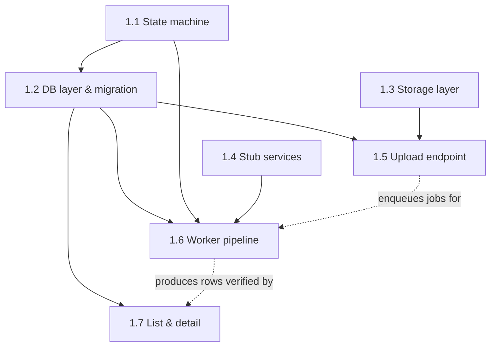

# Milestone 1 — Stubbed End-to-End Skeleton

> Roadmap for the task-by-task loop. Goal: prove the async architecture with
> fake data — upload moves `uploaded → transcribing → analyzing → completed`
> with canned results, before any external service is touched.
>
> Scope notes (agreed):
> - Retry: the `failed → transcribing` *transition rule* is defined in 1.1; the
>   retry *endpoint* is deferred to M2 (no real failures exist yet).
> - No pytest in M1 — each task ends with a manual verify step (curl, docker
>   logs). The test suite is M5.

---

## Task 1.1 — State machine

- **What:** Call status enum + legal-transition rules enforced in code; illegal transitions raise.
- **Files:** `backend/app/models/states.py`
- **Depends on:** nothing (pure logic)
- **Key decisions:**
  1. Transition API shape — a `can_transition(from, to)` predicate vs. an `assert_transition` that raises a domain exception the API/worker can map to HTTP/error codes?
  2. Does `retry` get modeled now as a named transition (`failed → transcribing`) even though no endpoint triggers it until M2?
  3. Where does the enum live so both SQLAlchemy (column type) and Pydantic (response schemas) share it without circular imports?

## Task 1.2 — DB layer & first migration

- **What:** Async engine/session factory, `calls` table (single table + JSONB columns), Alembic wired for async, first migration.
- **Files:** `backend/app/core/db.py`, `backend/app/models/call.py`, `backend/alembic.ini`, `backend/alembic/env.py`, `backend/alembic/versions/<first>.py`
- **Depends on:** 1.1 (status enum is the source of truth for the `status` column)
- **Key decisions:**
  1. Status column as native Postgres enum vs. `VARCHAR` + app-level validation — migrations pain vs. DB-level integrity?
  2. Primary key: UUID (client-safe, unguessable) vs. bigserial (cheap cursor pagination) — and what does 1.7's cursor paginate on?
  3. Which JSONB columns exist now (`transcript`, `analysis`, `tags`, `tag_overrides`?) and which nullable scalar columns are promoted out of JSONB (`error_code`, `duration`, `original_filename`)?

## Task 1.3 — Storage layer

- **What:** `Storage` protocol + `S3Storage` implementation (aioboto3) working against MinIO locally, R2 in prod by config alone.
- **Files:** `backend/app/services/storage.py`
- **Depends on:** nothing (config from M0)
- **Key decisions:**
  1. Protocol surface — minimum M1 needs is `save(stream, key)`; do `presigned_url(key)` and `delete(key)` enter the protocol now (M2 needs presigning) or later?
  2. Object key scheme — `{call_id}/{filename}` vs. `{call_id}.{ext}` — and who generates the id, API or DB?
  3. Client lifecycle — one aioboto3 session per app vs. per call; where does it get initialized (FastAPI lifespan, worker startup)?

## Task 1.4 — Stub services

- **What:** `transcribe()` and `analyze()` stubs returning canned diarized-transcript and analysis JSON in the exact shapes M2/M3 must later honor.
- **Files:** `backend/app/services/transcription.py`, `backend/app/services/analysis.py`
- **Depends on:** nothing (shapes defined here become the contract)
- **Key decisions:**
  1. The canned transcript/analysis shapes — settle the field names now (`speaker`, `start`, `end`, `text`; `summary`, `tags{outcome, objections, lead_temperature}`, `intent`, `mood`) since M2/M3 substitute behind these signatures.
  2. Stub latency — return instantly vs. `asyncio.sleep(~2s)` so the UI/polling can actually observe intermediate states?
  3. Signature contract — do services take a presigned URL / transcript string (production-shaped) or a `Call` row (convenient but couples services to the DB)?

## Task 1.5 — Upload endpoint

- **What:** `POST /calls` — validate WAV/MP3, stream to storage without buffering the file in memory, insert row, enqueue arq job, return `202 {id}`.
- **Files:** `backend/app/api/calls.py`, `backend/app/api/deps.py`, edits to `backend/app/main.py`
- **Depends on:** 1.2, 1.3
- **Key decisions:**
  1. Validation depth — extension + declared Content-Type only, or sniff magic bytes? (The 1,000 silent stubs and real MP3s must both pass.)
  2. arq Redis pool lifecycle — create once in FastAPI lifespan and inject as a dependency vs. per-request; what happens to the row if enqueue fails after the file is already in storage (orphan handling)?
  3. Streaming mechanics — multipart via `UploadFile` chunked copy vs. raw request body; enforce a max size now?

## Task 1.6 — Worker pipeline task

- **What:** One arq task walking the full state machine with DB-checkpointed stages, calling the 1.4 stubs; replaces the M0 `ping` placeholder.
- **Files:** `backend/app/worker/tasks.py`, edits to `backend/app/worker/settings.py`
- **Depends on:** 1.1, 1.2, 1.4 (verified end-to-end via 1.5's enqueue)
- **Key decisions:**
  1. Checkpoint granularity — status update + result persist as one transaction per stage; does the task re-read the row at start to skip completed stages (the M2 retry-skips-transcription contract, cheap to honor now)?
  2. Worker DB engine lifecycle — arq `on_startup`/`on_shutdown` hooks vs. per-job session; can it share `core/db.py` with the API?
  3. What does a crashed/interrupted job look like — arq retry semantics (`max_tries`, job timeout) and does a stuck `transcribing` row stay stuck in M1 (accepted) or get a guard now?

## Task 1.7 — List & detail endpoints

- **What:** `GET /calls` with cursor pagination + status filter, `GET /calls/{id}` returning full record (status, transcript, analysis).
- **Files:** edits to `backend/app/api/calls.py`, `backend/app/models/schemas.py`
- **Depends on:** 1.2 (uses rows produced by 1.5/1.6 for verification)
- **Key decisions:**
  1. Cursor encoding — opaque base64 of `(created_at, id)` vs. plain `after_id`; must stay stable under the 1,000-upload burst (ties in `created_at`).
  2. List payload — summary fields only (id, filename, status, created_at) vs. full rows; detail-only for transcript/analysis keeps the polled list cheap?
  3. Response schemas — one `CallOut` with optional fields vs. separate `CallListItem`/`CallDetail` models; how does `404` vs. `410`-style semantics work for unknown ids?

---

## Task order

Execution order: **1.1 → 1.2 → 1.3 → 1.4 → 1.5 → 1.6 → 1.7** (1.3 and 1.4 are
independent and can slot anywhere before their dependents).

*Milestone exit check:* `docker compose up` → upload a WAV via curl → poll the
list endpoint and watch the status walk to `completed` → detail endpoint shows
canned transcript + analysis → `docker compose restart` with a queued job loses
nothing.
