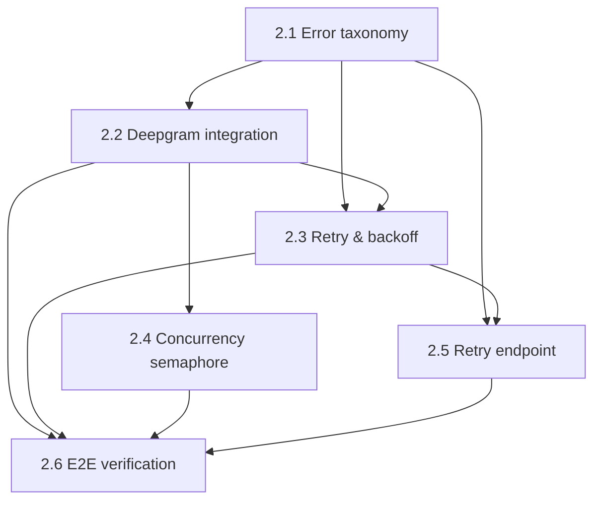

# Milestone 2 — Real Transcription (Deepgram)

> Roadmap for the task-by-task loop. Goal: replace the transcription stub with
> a production-shaped Deepgram integration that survives long files and
> provider failures — same `transcribe()` signature, so the worker pipeline
> from M1 barely changes.
>
> Scope notes (agreed):
> - Retry endpoint (`POST /calls/{id}/retry`) is in scope — M1 deferred it here.
> - Transient retries are owned by **arq** (`Retry` + `max_tries`); the row never
>   tracks attempt counts, only `error_code`. User-triggered retry is a *fresh
>   enqueue* on a `failed` row, not a resurrection of the exhausted job.
> - Concurrency semaphore is a **per-process `asyncio.Semaphore`** created in
>   arq `on_startup` — distributed variants are a README production note.
> - No pytest in M2 — each task ends with a manual verify step. The suite is M5.

---

## Task 2.1 — Error taxonomy

- **What:** Classification module mapping exceptions to `retryable` vs `permanent`, each with a machine-readable `error_code` (replaces the catch-all `"internal_error"`).
- **Files:** `backend/app/services/errors.py`
- **Depends on:** nothing (pure logic)
- **Key decisions:**
  1. Classification mechanism — domain exception hierarchy (`RetryableError` / `PermanentError` that services raise) vs. a `classify(exc)` function inspecting provider exceptions and status codes; who owns mapping Deepgram's errors into the taxonomy, the service or the classifier?
  2. Error-code vocabulary — the closed set of codes (`provider_rate_limited`, `provider_unavailable`, `transcription_timeout`, `audio_unreadable`, `internal_error`, …) and granularity: per-provider prefixes vs. generic codes reused by M3?
  3. Does "retryable but tries exhausted" get its own code, so the UI can distinguish *give-up-after-backoff* from *permanently rejected*?

## Task 2.2 — Deepgram integration

- **What:** Replace the `transcribe()` stub body with a real Deepgram call — presigned URL in; diarization, utterances, smart formatting, language detection on; `{language, text, utterances}` out in the exact M1 shape.
- **Files:** `backend/app/services/transcription.py`, edits to `backend/app/core/config.py`
- **Depends on:** 2.1 (raises classified errors, not raw SDK exceptions)
- **Key decisions:**
  1. `deepgram-sdk` vs. raw `httpx` — SDK convenience vs. one fewer dependency and direct control over timeouts and error surfaces (which 2.1 must classify either way).
  2. Presigned URL TTL vs. queue latency — is the 3600s default safe when a job may wait in the queue before running, and should the URL be generated per-attempt inside the task rather than once?
  3. Shape extensions — Deepgram returns duration and confidence; does `duration` get promoted into the row's column now (the open question from 1.2), and does anything else (confidence, detected language per utterance) enter the transcript JSON?

## Task 2.3 — Retry & backoff in the worker

- **What:** Wire 2.1 into `process_call`: retryable errors raise `arq.Retry` with exponential defer (capped by `max_tries`); permanent errors and exhausted retries mark `failed` with the specific `error_code`.
- **Files:** `backend/app/worker/tasks.py`, edits to `backend/app/worker/settings.py`
- **Depends on:** 2.1, 2.2
- **Key decisions:**
  1. Backoff schedule and caps — defer values (e.g. 5s → 25s → 125s), `max_tries=3`, and a `job_timeout` sized for 30-minute calls held open against Deepgram.
  2. Re-entry through the state machine — on an arq re-run the row is already `transcribing`; does `assert_transition` permit self-transitions, or does the task skip `_advance` when the status already matches?
  3. Final-failure sequencing — when tries are exhausted arq raises through; where exactly does the task persist `failed` + `error_code` before re-raising, and what does the row's status say *during* a deferred wait (stays `transcribing` — acceptable?)?

## Task 2.4 — Per-provider concurrency semaphore

- **What:** Cap concurrent Deepgram calls with an `asyncio.Semaphore` created in arq `on_startup`, independent of `max_jobs`.
- **Files:** edits to `backend/app/worker/settings.py`, `backend/app/worker/tasks.py`
- **Depends on:** 2.2 (wraps the real call; pointless around a stub)
- **Key decisions:**
  1. Limit value and its config knob (`DEEPGRAM_MAX_CONCURRENCY` env var, default ~5?) — sized against Deepgram's concurrent-request quota, not guessing.
  2. Who holds the semaphore — the worker task wraps `await transcribe(...)` (services stay free of global state) vs. passing it into the service; where does it live in `ctx`?
  3. Hold-time interaction — a 30-minute file holds the permit for minutes; how do `max_jobs` and the semaphore limit relate so jobs aren't parked holding neither permit nor progress, and does a second (placeholder) semaphore for the M3 LLM provider get created now?

## Task 2.5 — Retry endpoint

- **What:** `POST /calls/{id}/retry` — allowed only from `failed`; clears `error_code`, enqueues a fresh job, returns `202`; the checkpoint guarantees transcription is skipped if the transcript already exists.
- **Files:** edits to `backend/app/api/calls.py`, `backend/app/models/schemas.py`
- **Depends on:** 2.1, 2.3 (real failures and re-entry semantics must exist first)
- **Key decisions:**
  1. Preconditions — non-`failed` rows get `409`; is there a race with a still-in-flight job for the same call, and does the endpoint need to care?
  2. Who transitions the row — the endpoint moves `failed → transcribing` immediately (UI feedback, but lies if the queue is backed up) vs. the worker transitions on pickup (row says `failed` while queued)?
  3. Double-submit guard — two rapid retries enqueue two jobs; dedupe via deterministic arq job id (e.g. `retry:{call_id}`) or accept it (checkpoints make double-runs harmless but wasteful)?

## Task 2.6 — End-to-end verification

- **What:** The milestone exit check as a task: long-recording run, simulated provider failures landing in the correct path, and proof that retry-after-transcript never re-calls Deepgram.
- **Files:** none new (manual verify; optionally a note in `.claude/` recording results for the M7 narrative)
- **Depends on:** 2.2, 2.3, 2.4, 2.5
- **Key decisions:**
  1. Failure simulation method — invalid API key / garbage audio file vs. a temporary fault-injection env var in the transcription service; which covers both the retryable and permanent paths honestly?
  2. Checkpoint proof — how to *prove* Deepgram wasn't called on the second run: a "checkpoint hit, skipping transcription" log line, the Deepgram usage dashboard, or both?
  3. What gets recorded — do the verification results (timings for the 20–30 min file, observed retry behavior) get written down now as raw material for the README's testing/architecture sections?

---

## Task order

Execution order: **2.1 → 2.2 → 2.3 → 2.4 → 2.5 → 2.6** (2.4 and 2.5 are
independent of each other and can swap).

*Milestone exit check:* upload the 20–30 minute recording → speaker-labeled
transcript lands in the DB → force a retryable failure and watch backoff →
force a permanent failure and see `failed` + correct `error_code` → hit the
retry endpoint on a call with a persisted transcript → completed, with proof
Deepgram was never called the second time.
