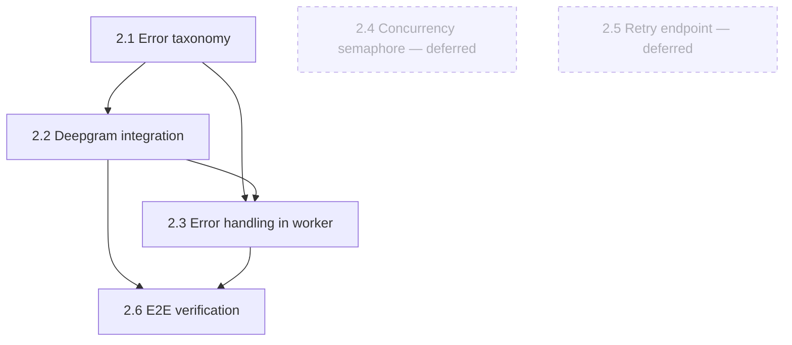

# Milestone 2 — Real Transcription (Deepgram)

> Roadmap for the task-by-task loop. Goal: replace the transcription stub with
> a production-shaped Deepgram integration that survives long files and
> provider failures — same `transcribe()` signature, so the worker pipeline
> from M1 barely changes.
>
> Scope notes (agreed — reduced M2):
> - **Failures are classified and surfaced, not retried.** The worker maps a
>   provider failure to a machine-readable `error_code` and marks the call
>   `failed`. `max_tries=1`, no backoff.
> - **Deferred to future improvements** (the error taxonomy makes both drop-in):
>   - automatic retry-with-backoff (`arq.Retry`) — 2.3 stays minimal;
>   - the user-triggered retry endpoint (`POST /calls/{id}/retry`) — was 2.5;
>   - the dedicated per-provider concurrency semaphore — was 2.4. At single-worker
>     scale arq's `max_jobs` (10) already caps concurrency under Deepgram's
>     50-request limit; the semaphore is the multi-worker scaling knob (plan §7).
> - Recovery from a transient failure is re-upload until the above land — a
>   documented limitation, honest because failures are visible with a code.
> - No pytest in M2 — each task ends with a manual verify step. The suite is M5.

---

## Task 2.1 — Error taxonomy

- **What:** Classification module mapping exceptions to `retryable` vs `permanent`, each with a machine-readable `error_code` (replaces the catch-all `"internal_error"`).
- **Files:** `backend/app/services/errors.py`
- **Depends on:** nothing (pure logic)
- **Key decisions:**
  1. Classification mechanism — domain exception hierarchy (`RetryableError` / `PermanentError` that services raise) vs. a `classify(exc)` function inspecting provider exceptions and status codes; who owns mapping Deepgram's errors into the taxonomy, the service or the classifier?
  2. Error-code vocabulary — the closed set of codes (`provider_rate_limited`, `provider_unavailable`, `transcription_timeout`, `audio_unreadable`, `internal_error`, …) and granularity: per-provider prefixes vs. generic codes reused by M3?
  3. Does "retryable but tries exhausted" get its own code, so the UI can distinguish *give-up-after-backoff* from *permanently rejected*?

## Task 2.2 — Deepgram integration

- **What:** Replace the `transcribe()` stub body with a real Deepgram call — presigned URL in; diarization, utterances, smart formatting, language detection on; `{language, text, utterances}` out in the exact M1 shape.
- **Files:** `backend/app/services/transcription.py`, edits to `backend/app/core/config.py`
- **Depends on:** 2.1 (raises classified errors, not raw SDK exceptions)
- **Key decisions:**
  1. `deepgram-sdk` vs. raw `httpx` — SDK convenience vs. one fewer dependency and direct control over timeouts and error surfaces (which 2.1 must classify either way).
  2. Presigned URL TTL vs. queue latency — is the 3600s default safe when a job may wait in the queue before running, and should the URL be generated per-attempt inside the task rather than once?
  3. Shape extensions — Deepgram returns duration and confidence; does `duration` get promoted into the row's column now (the open question from 1.2), and does anything else (confidence, detected language per utterance) enter the transcript JSON?

## Task 2.3 — Error handling in the worker (simplified)

- **What:** Wire 2.1 into `process_call`: catch `ProviderError`, mark the call `failed` with its specific `error_code`, re-raise for logs; unclassified exceptions fall back to `internal_error`. `max_tries=1`, no backoff. Keep the checkpoint-skip (`if transcript is None`) for crash-redelivery safety.
- **Files:** `backend/app/worker/tasks.py`, edits to `backend/app/worker/settings.py`
- **Depends on:** 2.1, 2.2
- **Key decisions (resolved):**
  1. No retry — a transient failure marks `failed`; recovery is re-upload until the deferred retry features land.
  2. `job_timeout` must exceed the 600s Deepgram request timeout (set to 900) so a slow transcription can't hit the job ceiling first.
  3. `_fail` helper does rollback → refresh → mark `failed` → commit, so a mid-stage failure never leaves a partial commit.

## Task 2.4 — Per-provider concurrency semaphore *(deferred → future improvements)*

Not built in reduced M2. At single-worker scale arq's `max_jobs` (default 10)
already caps concurrent Deepgram calls under the 50-request quota. The dedicated
`asyncio.Semaphore` is the multi-worker scaling knob — documented in
ARCHITECTURE.md / plan §7, implemented when a second worker is added.

## Task 2.5 — Retry endpoint *(deferred → future improvements)*

Not built in reduced M2. `POST /calls/{id}/retry` (`failed → transcribing`,
fresh enqueue, checkpoint skips transcription) is a clean future addition —
the state machine already models the transition and the error taxonomy already
distinguishes what is worth retrying.

## Task 2.6 — End-to-end verification

- **What:** The milestone exit check as a task: real long-recording run to `completed` with a diarized transcript persisted, and permanent provider failures landing in the correct path with the right `error_code`.
- **Files:** none new (manual verify; results noted in `.claude/milestone_2_results.md` for the M7 narrative)
- **Depends on:** 2.2, 2.3
- **Key decisions:**
  1. Failure simulation — garbage bytes named `.wav` (real Deepgram 4xx → `audio_unreadable`) and a silent file (200 empty → `no_speech_detected`); plus the `FAULT_INJECT_TRANSCRIPTION=permanent` lever for the worker path.
  2. What gets recorded — timings for the 20–30 min file and the observed failure codes, as raw material for the README testing/architecture sections.

---

## Task order

Execution order (reduced M2): **2.1 → 2.2 → 2.3 → 2.6**. 2.4 and 2.5 are
deferred to future improvements.

*Milestone exit check:* upload the 20–30 minute recording → speaker-labeled
transcript lands in the DB → force a permanent failure (garbage file, or
`FAULT_INJECT_TRANSCRIPTION=permanent`) and see `failed` + the correct
`error_code`.
