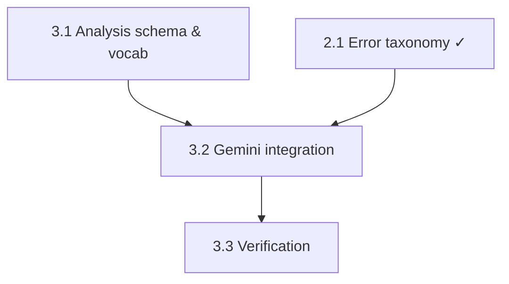

# Milestone 3 — LLM Analysis (Gemini)

> Roadmap for the task-by-task loop. Goal (kept simple): replace the `analyze()`
> stub with a real Gemini call that returns the existing contract shape —
> `summary`, `tags{outcome, objections, lead_temperature}`, `intent`,
> `mood{agent, customer}` — validated once via Gemini's native structured
> output. Get something working; add sophistication later.
>
> Scope notes (agreed):
> - **SDK/model:** `google-genai` (`from google import genai`) + `gemini-2.5-flash`,
>   `temperature=0`. Exact SDK surface verified by introspection at build time.
> - **Structured output:** pass the 3.1 Pydantic model as Gemini's
>   `response_schema` — output is shape-guaranteed, so validation is a single
>   `model_validate`, not a parse-and-repair loop.
> - **Input:** `analyze()` takes the **diarized transcript** (dict with
>   utterances), not flat text — the worker passes `call.transcript`. The prompt
>   renders utterances as `Speaker 0: … / Speaker 1: …`.
> - **Roles:** the LLM infers which speaker is agent vs. customer from content;
>   `mood` is keyed by role (`agent`/`customer`).
> - **Language:** `summary` always in English; tags/enums are language-neutral.
> - **Failures reuse M2:** a Gemini transport error or a post-response validation
>   failure becomes a `ProviderError` → the worker marks the call `failed` with a
>   machine-readable code. `max_tries=1`, no retry.
> - **Deferred to future improvements** (documented, not built): the repair-retry
>   loop; edge-case hardening (bilingual / one-sided / bad-diarization calls);
>   the tagging-eval methodology (golden set, periodic review, drift).
> - No pytest in M3 — each task ends with a manual verify step. The suite is M5.

---

## Task 3.1 — Analysis schema & closed vocabularies

- **What:** Pydantic models defining the analysis output plus the closed-vocabulary enums. One definition serves three roles: Gemini's `response_schema`, the post-response validator, and the documented shape of the `calls.analysis` JSONB.
- **Files:** `backend/app/models/analysis_schema.py` (new)
- **Depends on:** nothing (pure types)
- **Closed vocabularies (agreed):**
  - `outcome` (one, required): `meeting_scheduled · info_requested · not_interested · not_qualified · closed_won · no_clear_outcome`
  - `objections` (multi, may be empty): `price · timing · authority · need · trust · competitor`
  - `lead_temperature` (ordinal): `cold · warm · hot`
  - `intent` (one): `ready_to_buy · evaluating · gathering_info · price_shopping · not_interested`
  - `mood` per speaker (one each): `positive · neutral · negative · frustrated`
- **Key decisions:**
  1. Enums as `StrEnum` (mirror `CallStatus`) so one type is shared by Gemini schema, Pydantic, and JSON — and the vocabularies are the single source of truth.
  2. Model shape mirrors the stub exactly (`AnalysisResult` with nested `Tags` and `Mood`) so nothing downstream (worker persist, detail endpoint, frontend) changes.
  3. Does Gemini's `response_schema` accept these models as-is (enum + `list[Enum]` + nested models), or does any field need flattening for the SDK? Resolved at build time against the real SDK.

## Task 3.2 — Gemini integration

- **What:** Replace the `analyze()` body with a real Gemini call — build the prompt around the diarized transcript with speaker-role inference, request structured output via `response_schema`, validate with the 3.1 model, and map failures into the M2 error taxonomy. Change the worker to pass the full transcript.
- **Files:** `backend/app/services/analysis.py`, edits to `backend/app/worker/tasks.py`, `backend/app/core/config.py` (Gemini client config)
- **Depends on:** 3.1, 2.1 (error taxonomy)
- **Key decisions:**
  1. Signature change — `analyze(transcript: dict) -> dict`; the worker calls `analyze(call.transcript)` instead of `analyze(call.transcript["text"])`. The service renders the utterances into the prompt; it stays ignorant of the DB.
  2. Prompt design — a system instruction stating the analyst role, the closed vocabularies, the agent/customer inference rule, and "summary in English"; the diarized transcript as the user content. Kept in the service, versionable.
  3. Error mapping — Gemini transport errors → `classify_http_status` (permanent_code `analysis_failed`); a post-response Pydantic validation failure → permanent `analysis_invalid` (the response_schema makes this rare, but it must fail visibly, never persist junk). Empty/blocked responses (safety filters) → `analysis_blocked`, permanent.
  4. Determinism — `temperature=0` for stable, reproducible tags.

## Task 3.3 — Verification

- **What:** Run the real pipeline against the `recordings/` files and confirm the analysis is coherent and schema-valid; confirm a forced failure lands in `failed` with the right code.
- **Files:** none new (manual verify; results appended to `.claude/milestone_2_results.md` or a new `milestone_3_results.md`)
- **Depends on:** 3.1, 3.2
- **Key decisions:**
  1. What "coherent" means — spot-check that `outcome`/`intent`/`mood` match the call content, `objections` are actually raised, and the summary is faithful and in English.
  2. Failure path — force a Gemini failure (`FAULT_INJECT_ANALYSIS=permanent`, reusing the M2 lever) and confirm `failed | analysis_failed` in one attempt, with the transcript checkpoint preserved (retry-later would skip transcription).
  3. What gets recorded — the analysis outputs for the four real recordings, as raw material for the M7 tagging-schema justification.

---

## Task order

Execution order: **3.1 → 3.2 → 3.3**. Each task ends with a commit.

*Milestone exit check:* a completed call carries a schema-valid `analysis` —
faithful English summary, closed-vocab tags, customer intent, and per-speaker
mood; a forced Gemini failure lands the call in `failed` with a machine-readable
code, never a half-written analysis.
